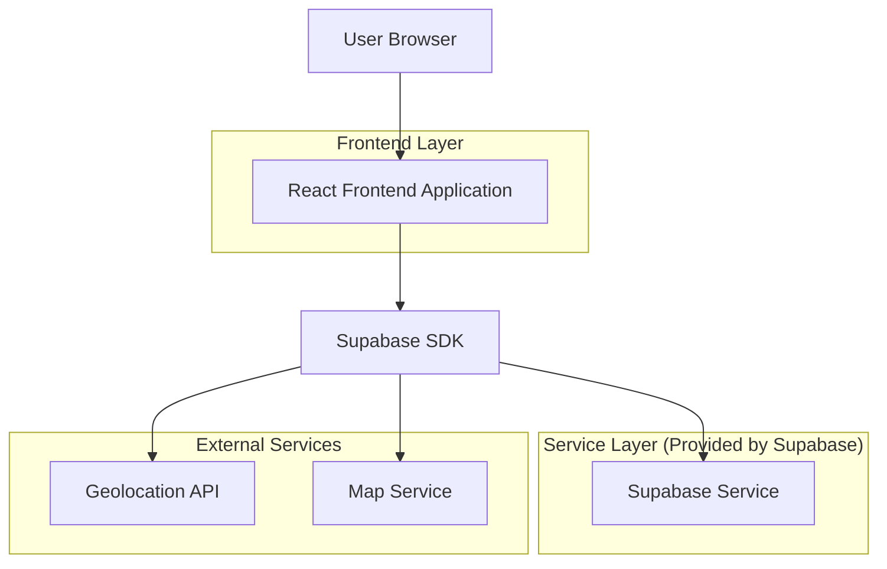
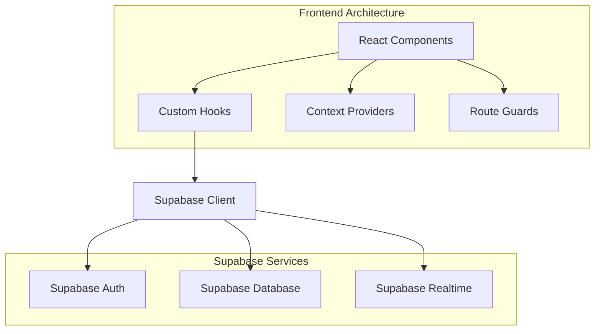
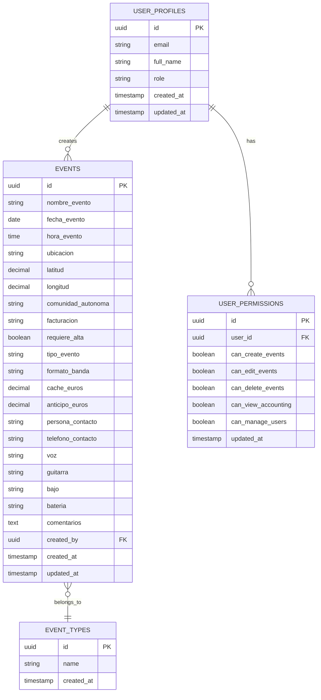

# Arquitectura Técnica - Plataforma de Gestión de Eventos Musicales

## 1. Architecture design



## 2. Technology Description

- Frontend: React@18 + TypeScript@5 + Tailwind CSS@3 + Vite
- Backend: Supabase (Authentication, Database, Real-time)
- Maps: Leaflet o Google Maps API
- Geolocation: Browser Geolocation API + Geocoding service

## 3. Route definitions

| Route | Purpose |
|-------|---------|
| / | Redirect to /dashboard or /login based on auth status |
| /login | Login page with email/password authentication |
| /dashboard | Main dashboard with calendar, map, and statistics |
| /events | Event listing page with filters and pagination |
| /events/new | Create new event form |
| /events/:id | View/edit specific event details |
| /accounting | Financial summary and reports (permission required) |
| /admin | User management and permissions (admin only) |
| /admin/users | User management interface |
| /admin/permissions | Permission configuration interface |
| /profile | User profile and settings |

## 4. API definitions

### 4.1 Core API

**Authentication (Supabase Auth)**
```typescript
// Login
supabase.auth.signInWithPassword({ email, password })

// Register
supabase.auth.signUp({ email, password })

// Logout
supabase.auth.signOut()
```

**Events Management**
```typescript
// Get events
GET /rest/v1/events
Query params: select, order, limit, offset, filters

// Create event
POST /rest/v1/events
Body: EventCreateRequest

// Update event
PATCH /rest/v1/events?id=eq.{id}
Body: EventUpdateRequest

// Delete event
DELETE /rest/v1/events?id=eq.{id}
```

**User Management**
```typescript
// Get users (admin only)
GET /rest/v1/user_profiles

// Update user permissions
PATCH /rest/v1/user_profiles?id=eq.{id}
Body: { permissions: UserPermissions }
```

### 4.2 Type Definitions

```typescript
interface Event {
  id: string;
  nombre_evento: string;
  fecha_evento: string;
  hora_evento: string;
  ubicacion: string;
  latitud: number;
  longitud: number;
  comunidad_autonoma: string;
  facturacion: 'No' | 'Sí' | 'Anticipo';
  requiere_alta: boolean;
  tipo_evento: string;
  formato_banda: 'Banda' | 'Trío' | 'Dúo';
  cache_euros: number;
  anticipo_euros: number;
  persona_contacto: string;
  telefono_contacto: string;
  voz: 'Julio' | 'Sustituto';
  guitarra: 'Santi' | 'Sustituto';
  bajo: 'Pablo' | 'Sustituto';
  bateria: 'Javi' | 'Sustituto';
  comentarios: string;
  created_at: string;
  updated_at: string;
  created_by: string;
}

interface UserProfile {
  id: string;
  email: string;
  full_name: string;
  role: 'admin' | 'user';
  permissions: UserPermissions;
  created_at: string;
}

interface UserPermissions {
  can_create_events: boolean;
  can_edit_events: boolean;
  can_delete_events: boolean;
  can_view_accounting: boolean;
  can_manage_users: boolean;
}

interface EventType {
  id: string;
  name: string;
  created_at: string;
}
```

## 5. Server architecture diagram



## 6. Data model

### 6.1 Data model definition



### 6.2 Data Definition Language

**User Profiles Table**
```sql
-- Create user profiles table
CREATE TABLE user_profiles (
    id UUID PRIMARY KEY DEFAULT gen_random_uuid(),
    email VARCHAR(255) UNIQUE NOT NULL,
    full_name VARCHAR(100) NOT NULL,
    role VARCHAR(20) DEFAULT 'user' CHECK (role IN ('admin', 'user')),
    created_at TIMESTAMP WITH TIME ZONE DEFAULT NOW(),
    updated_at TIMESTAMP WITH TIME ZONE DEFAULT NOW()
);

-- RLS policies
ALTER TABLE user_profiles ENABLE ROW LEVEL SECURITY;

CREATE POLICY "Users can view own profile" ON user_profiles
    FOR SELECT USING (auth.uid() = id);

CREATE POLICY "Admins can view all profiles" ON user_profiles
    FOR SELECT USING (
        EXISTS (
            SELECT 1 FROM user_profiles 
            WHERE id = auth.uid() AND role = 'admin'
        )
    );

-- Grant permissions
GRANT SELECT ON user_profiles TO authenticated;
GRANT ALL PRIVILEGES ON user_profiles TO authenticated;
```

**Events Table**
```sql
-- Create events table
CREATE TABLE events (
    id UUID PRIMARY KEY DEFAULT gen_random_uuid(),
    nombre_evento VARCHAR(200) NOT NULL,
    fecha_evento DATE NOT NULL,
    hora_evento TIME NOT NULL,
    ubicacion VARCHAR(300) NOT NULL,
    latitud DECIMAL(10, 8),
    longitud DECIMAL(11, 8),
    comunidad_autonoma VARCHAR(50),
    facturacion VARCHAR(20) DEFAULT 'No' CHECK (facturacion IN ('No', 'Sí', 'Anticipo')),
    requiere_alta BOOLEAN DEFAULT false,
    tipo_evento VARCHAR(100),
    formato_banda VARCHAR(20) DEFAULT 'Banda' CHECK (formato_banda IN ('Banda', 'Trío', 'Dúo')),
    cache_euros DECIMAL(10, 2) DEFAULT 0,
    anticipo_euros DECIMAL(10, 2) DEFAULT 0,
    persona_contacto VARCHAR(100),
    telefono_contacto VARCHAR(20),
    voz VARCHAR(50) DEFAULT 'Julio' CHECK (voz IN ('Julio', 'Sustituto')),
    guitarra VARCHAR(50) DEFAULT 'Santi' CHECK (guitarra IN ('Santi', 'Sustituto')),
    bajo VARCHAR(50) DEFAULT 'Pablo' CHECK (bajo IN ('Pablo', 'Sustituto')),
    bateria VARCHAR(50) DEFAULT 'Javi' CHECK (bateria IN ('Javi', 'Sustituto')),
    comentarios TEXT,
    created_by UUID REFERENCES user_profiles(id),
    created_at TIMESTAMP WITH TIME ZONE DEFAULT NOW(),
    updated_at TIMESTAMP WITH TIME ZONE DEFAULT NOW()
);

-- Create indexes
CREATE INDEX idx_events_fecha ON events(fecha_evento DESC);
CREATE INDEX idx_events_comunidad ON events(comunidad_autonoma);
CREATE INDEX idx_events_tipo ON events(tipo_evento);
CREATE INDEX idx_events_created_by ON events(created_by);

-- RLS policies
ALTER TABLE events ENABLE ROW LEVEL SECURITY;

CREATE POLICY "Anyone can view events" ON events
    FOR SELECT USING (true);

CREATE POLICY "Authenticated users can create events" ON events
    FOR INSERT WITH CHECK (auth.uid() IS NOT NULL);

CREATE POLICY "Users can edit own events or with permission" ON events
    FOR UPDATE USING (
        created_by = auth.uid() OR
        EXISTS (
            SELECT 1 FROM user_permissions up
            JOIN user_profiles u ON u.id = up.user_id
            WHERE u.id = auth.uid() AND (up.can_edit_events = true OR u.role = 'admin')
        )
    );

-- Grant permissions
GRANT SELECT ON events TO anon;
GRANT ALL PRIVILEGES ON events TO authenticated;
```

**Event Types Table**
```sql
-- Create event types table
CREATE TABLE event_types (
    id UUID PRIMARY KEY DEFAULT gen_random_uuid(),
    name VARCHAR(100) UNIQUE NOT NULL,
    created_at TIMESTAMP WITH TIME ZONE DEFAULT NOW()
);

-- Insert initial data
INSERT INTO event_types (name) VALUES 
    ('Concierto'),
    ('Festival'),
    ('Boda'),
    ('Evento Corporativo'),
    ('Fiesta Privada');

-- Grant permissions
GRANT SELECT ON event_types TO anon;
GRANT ALL PRIVILEGES ON event_types TO authenticated;
```

**User Permissions Table**
```sql
-- Create user permissions table
CREATE TABLE user_permissions (
    id UUID PRIMARY KEY DEFAULT gen_random_uuid(),
    user_id UUID REFERENCES user_profiles(id) ON DELETE CASCADE,
    can_create_events BOOLEAN DEFAULT false,
    can_edit_events BOOLEAN DEFAULT false,
    can_delete_events BOOLEAN DEFAULT false,
    can_view_accounting BOOLEAN DEFAULT false,
    can_manage_users BOOLEAN DEFAULT false,
    updated_at TIMESTAMP WITH TIME ZONE DEFAULT NOW(),
    UNIQUE(user_id)
);

-- Create trigger for automatic permission creation
CREATE OR REPLACE FUNCTION create_user_permissions()
RETURNS TRIGGER AS $$
BEGIN
    INSERT INTO user_permissions (user_id)
    VALUES (NEW.id);
    RETURN NEW;
END;
$$ LANGUAGE plpgsql;

CREATE TRIGGER on_user_created
    AFTER INSERT ON user_profiles
    FOR EACH ROW EXECUTE FUNCTION create_user_permissions();

-- Grant permissions
GRANT ALL PRIVILEGES ON user_permissions TO authenticated;
```