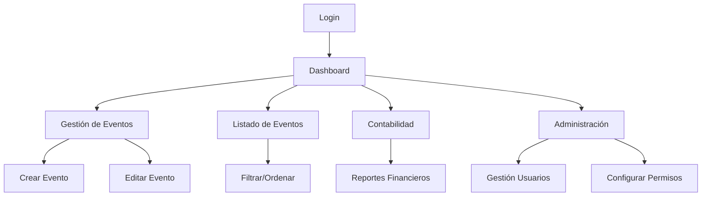

# Plataforma de Gestión de Eventos Musicales

## 1. Product Overview
Plataforma web integral para la gestión de eventos musicales de una banda, permitiendo organizar conciertos, controlar la facturación y coordinar a los miembros del grupo.

Soluciona la necesidad de centralizar toda la información de eventos musicales en una sola aplicación, facilitando la planificación, seguimiento financiero y coordinación de la banda.

Objetivo: Digitalizar y optimizar la gestión completa de eventos musicales para bandas profesionales.

## 2. Core Features

### 2.1 User Roles

| Role | Registration Method | Core Permissions |
|------|---------------------|------------------|
| Administrador | Registro inicial del sistema | Acceso completo: gestión de usuarios, configuración de permisos, todas las funcionalidades |
| Usuario | Invitación por administrador | Solo visualización por defecto, permisos configurables (crear eventos, acceso a contabilidad, etc.) |

### 2.2 Feature Module

Nuestra plataforma de gestión de eventos musicales consta de las siguientes páginas principales:

1. **Dashboard**: calendario interactivo, mapa de eventos, resumen próximos eventos, estadísticas financieras.
2. **Gestión de Eventos**: formulario crear/editar eventos, tipos dinámicos, geolocalización automática.
3. **Listado de Eventos**: vista tabular con filtros, ordenación, paginación.
4. **Contabilidad**: resumen financiero, estados de facturación, informes por período.
5. **Administración**: gestión de usuarios, configuración de permisos.
6. **Login/Registro**: autenticación de usuarios.

### 2.3 Page Details

| Page Name | Module Name | Feature description |
|-----------|-------------|---------------------|
| Dashboard | Calendario Interactivo | Mostrar eventos por colores según tipo, navegación mensual, vista semanal/mensual |
| Dashboard | Mapa Península Ibérica | Visualizar marcadores de eventos por coordenadas exactas, información al hacer clic |
| Dashboard | Resumen Próximos Eventos | Mostrar 3 próximos eventos con fecha, hora, ubicación, tipo y formato de banda |
| Dashboard | Estadísticas | Mostrar eventos del mes actual, ingresos totales y pendientes |
| Gestión de Eventos | Formulario de Evento | Crear/editar eventos con todos los campos: nombre, fecha, hora, ubicación, facturación, contacto, miembros |
| Gestión de Eventos | Tipos Dinámicos | Permitir crear nuevos tipos de evento con texto libre que se guardan para futuros eventos |
| Gestión de Eventos | Geolocalización | Obtener coordenadas automáticamente a partir de la dirección ingresada |
| Gestión de Eventos | Validaciones | Validar campos obligatorios, formatos de fecha/hora, confirmaciones de eliminación |
| Listado de Eventos | Vista Tabular | Mostrar todos los eventos en tabla con información clave |
| Listado de Eventos | Filtros Avanzados | Filtrar por rango de fechas, tipo de evento, comunidad autónoma, estado de facturación |
| Listado de Eventos | Ordenación | Ordenar por fecha, caché, ubicación, tipo de evento |
| Listado de Eventos | Paginación | Dividir resultados en páginas para mejor rendimiento |
| Contabilidad | Resumen Financiero | Mostrar total de cachés, anticipos recibidos, pagos pendientes |
| Contabilidad | Estados Facturación | Visualizar eventos por estado: sin facturar, facturado, anticipo, pagado |
| Contabilidad | Informes por Período | Generar reportes financieros por mes, trimestre, año |
| Administración | Gestión de Usuarios | Crear, editar, eliminar usuarios del sistema |
| Administración | Configuración Permisos | Asignar permisos específicos a cada usuario (crear eventos, ver contabilidad, etc.) |
| Login/Registro | Autenticación | Login con email/contraseña, registro de nuevos usuarios, recuperación de contraseña |

## 3. Core Process

**Flujo de Administrador:**
1. Login → Dashboard → Gestión completa de eventos, usuarios y permisos
2. Puede crear/editar/eliminar eventos, acceder a contabilidad y administrar usuarios

**Flujo de Usuario:**
1. Login → Dashboard → Visualización según permisos asignados
2. Si tiene permisos: puede crear/editar eventos y/o acceder a contabilidad
3. Si no tiene permisos: solo visualización de eventos

## 4. User Interface Design

### 4.1 Design Style

- **Colores primarios:** Celeste #2DB2CA (principal), Naranja apagado #BDB3A4 (secundario)
- **Colores de apoyo:** Rojo pastel #E58483 (alertas), Amarillo claro #FAF9ED (fondo), Blanco #FFFFFF (contraste)
- **Estilo de botones:** Redondeados con sombra sutil, efecto hover
- **Tipografía:** Inter o similar, tamaños 14px (texto), 16px (botones), 24px (títulos)
- **Layout:** Diseño tipo dashboard con sidebar de navegación, cards para información
- **Iconos:** Estilo outline moderno, uso de emojis para tipos de eventos (🎵🎸🎤)

### 4.2 Page Design Overview

| Page Name | Module Name | UI Elements |
|-----------|-------------|-------------|
| Dashboard | Calendario | Grid mensual con eventos coloreados, navegación con flechas, vista responsive |
| Dashboard | Mapa | Mapa interactivo de España con marcadores celestes, popup con info del evento |
| Dashboard | Próximos Eventos | Cards horizontales con fecha destacada, información del evento y estado |
| Dashboard | Estadísticas | Cards con números grandes, iconos representativos, colores de la paleta |
| Gestión de Eventos | Formulario | Layout de 2 columnas, campos agrupados lógicamente, botones de acción destacados |
| Listado de Eventos | Tabla | Tabla responsive con headers fijos, filas alternadas, acciones por fila |
| Contabilidad | Resumen | Dashboard financiero con gráficos simples, cards de totales |
| Administración | Gestión Usuarios | Lista de usuarios con acciones inline, modal para edición de permisos |

### 4.3 Responsiveness

Diseño mobile-first con adaptación completa para desktop. Optimización táctil para dispositivos móviles con botones de tamaño adecuado y navegación por gestos. El calendario y mapa se adaptan completamente a pantallas pequeñas.