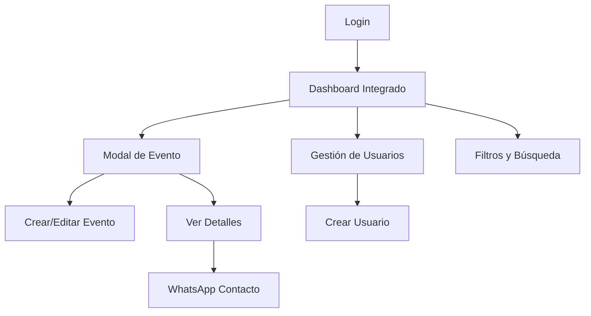

# Documento de Requisitos del Producto - TriBeCa

## 1. Visión General del Producto

TriBeCa es una plataforma web para la gestión integral de eventos musicales que permite a las empresas organizadoras llevar un control completo de toda la información relevante de forma práctica y visual. La plataforma facilita la organización de eventos con diferentes formatos de banda, gestión financiera, asignación de músicos y seguimiento de estados.

La plataforma resuelve la necesidad de centralizar la información de eventos musicales, automatizar cálculos financieros y proporcionar una interfaz intuitiva para la gestión diaria de eventos.

## 2. Características Principales

### 2.1 Roles de Usuario

| Rol | Método de Registro | Permisos Principales |
|-----|-------------------|---------------------|
| Admin | Creado por otro admin | Gestión completa: crear, editar, eliminar eventos y usuarios |
| User | Creado por admin con contraseña temporal | Solo visualización de eventos |

### 2.2 Módulo de Características

Nuestra plataforma de gestión de eventos musicales consta de las siguientes páginas principales:

1. **Dashboard Integrado**: calendario mensual (lado izquierdo), lista de eventos con filtros (lado derecho), modal/sidebar para crear y editar eventos
2. **Gestión de Usuarios**: administración de usuarios y permisos (solo admins)
3. **Login/Registro**: autenticación y cambio de contraseña inicial

### 2.3 Detalles de Páginas

| Nombre de Página | Nombre del Módulo | Descripción de Características |
|------------------|-------------------|--------------------------------|
| Dashboard Integrado | Calendario | Mostrar eventos del mes actual con navegación mensual en panel izquierdo |
| Dashboard Integrado | Lista de Eventos | Panel derecho con lista filtrable y expandible de eventos |
| Dashboard Integrado | Filtros y Búsqueda | Filtrar por próximos/pasados, tipo de evento, mes; buscar por nombre/ubicación |
| Dashboard Integrado | Modal de Evento | Modal/sidebar para crear, editar y ver detalles completos de eventos |
| Dashboard Integrado | Datos Básicos | Capturar nombre, fecha/hora, ubicación, contacto, comentarios en modal |
| Dashboard Integrado | Información Financiera | Gestionar caché, anticipo, IVA, estado de factura, alta del evento |
| Dashboard Integrado | Gestión de Músicos | Asignar músicos principales y sustitutos por instrumento |
| Dashboard Integrado | Cálculos Automáticos | Calcular formato de banda y desglose de IVA automáticamente |
| Dashboard Integrado | Acciones Rápidas | Editar, eliminar, WhatsApp directo desde lista (según permisos) |
| Gestión de Usuarios | Lista de Usuarios | Mostrar usuarios con estado activo/inactivo y roles |
| Gestión de Usuarios | Crear Usuario | Formulario para crear usuarios con permisos específicos |
| Gestión de Usuarios | Gestión de Permisos | Asignar y modificar permisos individuales de usuarios |
| Login | Autenticación | Validar credenciales y gestionar sesiones |
| Login | Cambio de Contraseña | Forzar cambio de contraseña temporal en primer acceso |

## 3. Proceso Principal

**Flujo de Admin:**
El administrador accede al dashboard integrado donde ve el calendario (izquierda) y lista de eventos (derecha). Puede crear nuevos eventos abriendo el modal desde el botón de acción rápida, editar eventos existentes haciendo clic en la lista, y gestionar usuarios desde el menú de navegación.

**Flujo de Usuario Regular:**
El usuario accede al dashboard integrado para visualizar el calendario y lista de eventos. Puede usar filtros, búsquedas y ver detalles de eventos en el modal, pero no puede modificar información ni acceder a la gestión de usuarios.

## 4. Diseño de Interfaz de Usuario

### 4.1 Estilo de Diseño

- **Colores primarios y secundarios**: Celeste (#2DB2CA), Rojo pastel (#E58483), Naranja apagado (#BDB3A4), Amarillo claro (#FAF9ED), Blanco (#FFFFFF)
- **Estilo de botones**: Redondeados con sombras sutiles para efecto moderno
- **Fuente y tamaños preferidos**: Sans-serif moderna, tamaños 14px-16px para texto, 18px-24px para títulos
- **Estilo de layout**: Diseño basado en tarjetas con navegación lateral, header fijo
- **Sugerencias de emojis/iconos**: Iconos minimalistas de línea, emojis musicales (🎵, 🎸, 🥁) para tipos de eventos

### 4.2 Resumen de Diseño de Páginas

| Nombre de Página | Nombre del Módulo | Elementos de UI |
|------------------|-------------------|----------------|
| Dashboard Integrado | Header | Logo TriBeCa, datos de usuario, navegación principal con colores celeste y blanco |
| Dashboard Integrado | Panel Calendario | Grid mensual en lado izquierdo con eventos marcados en rojo pastel, navegación con flechas |
| Dashboard Integrado | Panel Lista | Lista de eventos en lado derecho con tarjetas expandibles y animaciones suaves |
| Dashboard Integrado | Filtros | Barra superior con dropdown y campos de búsqueda, bordes redondeados, colores celeste |
| Dashboard Integrado | Modal de Evento | Modal/sidebar deslizable con inputs de labels flotantes, validación visual |
| Dashboard Integrado | Cálculos en Modal | Secciones destacadas para mostrar totales con IVA en tarjetas amarillo claro |
| Dashboard Integrado | Botones de Acción | Botones flotantes y en lista con colores naranja apagado, iconos claros |
| Gestión de Usuarios | Tabla | Tabla responsive con estados visuales, botones de acción diferenciados por color |

### 4.3 Responsividad

La plataforma es desktop-first con adaptación móvil completa. En móvil, la navegación lateral se convierte en menú hamburguesa superior, las tarjetas se apilan verticalmente, y se optimiza la interacción táctil con botones más grandes y espaciado adecuado.