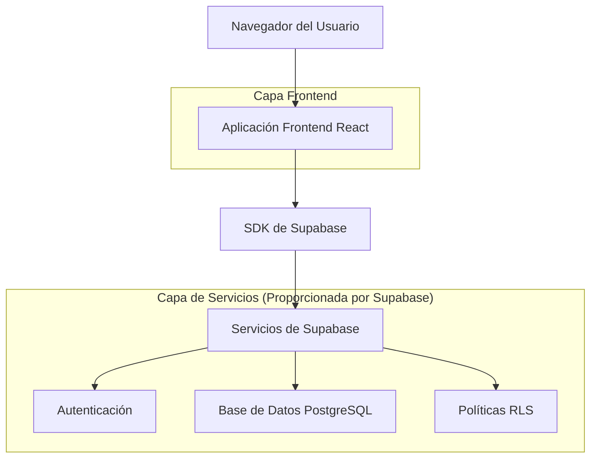
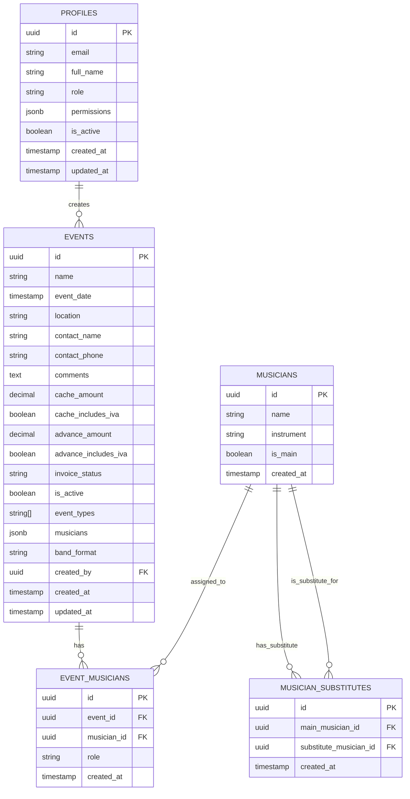

# Documento de Arquitectura Técnica - TriBeCa

## 1. Diseño de Arquitectura



## 2. Descripción de Tecnologías

- **Frontend**: React@18 + TailwindCSS@3 + Vite + React Router + React Hook Form
- **Backend**: Supabase (BaaS completo)
- **Base de Datos**: Supabase PostgreSQL
- **Autenticación**: Supabase Auth
- **Librerías adicionales**: React Calendar, Lucide React (iconos), React Hot Toast

## 3. Definiciones de Rutas

| Ruta | Propósito |
|------|----------|
| / | Dashboard integrado con calendario (izquierda), lista de eventos (derecha) y modal para gestión |
| /login | Página de inicio de sesión y cambio de contraseña |
| /users | Gestión de usuarios (solo admins) |
| /users/new | Formulario para crear nuevo usuario (solo admins) |

## 4. Definiciones de API

### 4.1 API Principal

**Autenticación de usuarios**
```
POST /auth/v1/token
```

Request:
| Nombre del Parámetro | Tipo | Requerido | Descripción |
|---------------------|------|-----------|-------------|
| email | string | true | Email del usuario |
| password | string | true | Contraseña del usuario |

Response:
| Nombre del Parámetro | Tipo | Descripción |
|---------------------|------|-------------|
| access_token | string | Token de acceso JWT |
| user | object | Información del usuario |

**Gestión de eventos**
```
GET /rest/v1/events
POST /rest/v1/events
PATCH /rest/v1/events?id=eq.{id}
DELETE /rest/v1/events?id=eq.{id}
```

**Gestión de usuarios**
```
GET /rest/v1/profiles
POST /rest/v1/profiles
PATCH /rest/v1/profiles?id=eq.{id}
```

Ejemplo de evento:
```json
{
  "name": "Boda García-López",
  "event_date": "2024-06-15T19:00:00Z",
  "location": "Hotel Majestic",
  "contact_name": "María García",
  "contact_phone": "+34666123456",
  "cache_amount": 1500.00,
  "cache_includes_iva": true,
  "advance_amount": 500.00,
  "advance_includes_iva": true,
  "invoice_status": "advance",
  "is_active": true,
  "event_types": ["boda"],
  "musicians": {
    "voz": "julio",
    "guitarra": "santi",
    "bajo": "pablo",
    "bateria": "javi"
  }
}
```

## 5. Modelo de Datos

### 5.1 Definición del Modelo de Datos



### 5.2 Lenguaje de Definición de Datos

**Tabla de Perfiles (profiles)**
```sql
-- Crear tabla de perfiles
CREATE TABLE profiles (
    id UUID PRIMARY KEY DEFAULT gen_random_uuid(),
    email VARCHAR(255) UNIQUE NOT NULL,
    full_name VARCHAR(100) NOT NULL,
    role VARCHAR(20) DEFAULT 'user' CHECK (role IN ('admin', 'user')),
    permissions JSONB DEFAULT '{"create": false, "edit": false, "delete": false}',
    is_active BOOLEAN DEFAULT true,
    created_at TIMESTAMP WITH TIME ZONE DEFAULT NOW(),
    updated_at TIMESTAMP WITH TIME ZONE DEFAULT NOW()
);

-- Crear tabla de eventos
CREATE TABLE events (
    id UUID PRIMARY KEY DEFAULT gen_random_uuid(),
    name VARCHAR(200) NOT NULL,
    event_date TIMESTAMP WITH TIME ZONE NOT NULL,
    location VARCHAR(200) NOT NULL,
    contact_name VARCHAR(100) NOT NULL,
    contact_phone VARCHAR(20) NOT NULL,
    comments TEXT,
    cache_amount DECIMAL(10,2) NOT NULL,
    cache_includes_iva BOOLEAN DEFAULT false,
    advance_amount DECIMAL(10,2) DEFAULT 0,
    advance_includes_iva BOOLEAN DEFAULT false,
    invoice_status VARCHAR(20) DEFAULT 'no' CHECK (invoice_status IN ('no', 'yes', 'advance')),
    is_active BOOLEAN DEFAULT true,
    event_types TEXT[] DEFAULT '{}',
    musicians JSONB DEFAULT '{}',
    band_format VARCHAR(20),
    created_by UUID REFERENCES profiles(id),
    created_at TIMESTAMP WITH TIME ZONE DEFAULT NOW(),
    updated_at TIMESTAMP WITH TIME ZONE DEFAULT NOW()
);

-- Crear tabla de músicos
CREATE TABLE musicians (
    id UUID PRIMARY KEY DEFAULT gen_random_uuid(),
    name VARCHAR(100) NOT NULL,
    instrument VARCHAR(50) NOT NULL,
    is_main BOOLEAN DEFAULT false,
    created_at TIMESTAMP WITH TIME ZONE DEFAULT NOW()
);

-- Crear tabla de músicos por evento
CREATE TABLE event_musicians (
    id UUID PRIMARY KEY DEFAULT gen_random_uuid(),
    event_id UUID REFERENCES events(id) ON DELETE CASCADE,
    musician_id UUID REFERENCES musicians(id),
    role VARCHAR(20) DEFAULT 'main' CHECK (role IN ('main', 'substitute')),
    created_at TIMESTAMP WITH TIME ZONE DEFAULT NOW()
);

-- Crear tabla de sustitutos
CREATE TABLE musician_substitutes (
    id UUID PRIMARY KEY DEFAULT gen_random_uuid(),
    main_musician_id UUID REFERENCES musicians(id),
    substitute_musician_id UUID REFERENCES musicians(id),
    created_at TIMESTAMP WITH TIME ZONE DEFAULT NOW()
);

-- Crear índices
CREATE INDEX idx_events_date ON events(event_date DESC);
CREATE INDEX idx_events_created_by ON events(created_by);
CREATE INDEX idx_events_active ON events(is_active);
CREATE INDEX idx_profiles_email ON profiles(email);
CREATE INDEX idx_profiles_active ON profiles(is_active);

-- Políticas RLS
ALTER TABLE profiles ENABLE ROW LEVEL SECURITY;
ALTER TABLE events ENABLE ROW LEVEL SECURITY;
ALTER TABLE musicians ENABLE ROW LEVEL SECURITY;
ALTER TABLE event_musicians ENABLE ROW LEVEL SECURITY;
ALTER TABLE musician_substitutes ENABLE ROW LEVEL SECURITY;

-- Permisos básicos
GRANT SELECT ON profiles TO anon;
GRANT ALL PRIVILEGES ON profiles TO authenticated;
GRANT SELECT ON events TO anon;
GRANT ALL PRIVILEGES ON events TO authenticated;
GRANT SELECT ON musicians TO anon;
GRANT ALL PRIVILEGES ON musicians TO authenticated;
GRANT ALL PRIVILEGES ON event_musicians TO authenticated;
GRANT ALL PRIVILEGES ON musician_substitutes TO authenticated;

-- Datos iniciales
INSERT INTO musicians (name, instrument, is_main) VALUES
('Julio', 'voz', true),
('Santi', 'guitarra', true),
('Pablo', 'bajo', true),
('Javi', 'bateria', true);

INSERT INTO profiles (email, full_name, role, permissions, is_active) VALUES
('admin@tribeca.com', 'Administrador TriBeCa', 'admin', '{"create": true, "edit": true, "delete": true}', true);
```